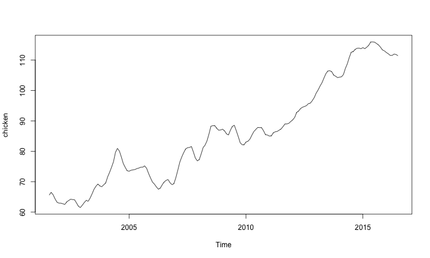

Getting Started
========================================================

Getting the S&S Data
========================================================

All of the datasets used in S&S are in the `astsa` package


```r
install.packages("astsa")
```

We are going to take a quick look at the `chicken` data

```r
library(astsa)
data(chicken)
```
The `chicken` data is already formatted as a `ts` object. 

Chicken Data
========================================================

$\boldsymbol x$:
monthly price/pound of chicken August 2001-July 2016

<font size=0.9> 

```r
chicken
```

```
        Jan    Feb    Mar    Apr    May    Jun    Jul    Aug    Sep    Oct
2001                                                   65.58  66.48  65.70
2002  62.94  62.92  62.73  62.50  63.35  63.80  64.21  64.11  64.04  63.00
2003  62.27  63.13  63.86  63.53  64.60  65.99  67.50  68.50  69.23  68.57
2004  69.58  71.59  73.09  74.75  76.59  79.63  80.94  80.10  78.16  76.00
2005  73.44  73.75  73.88  74.00  74.29  74.48  74.75  74.77  75.19  74.38
2006  69.86  69.18  68.29  67.52  67.87  68.98  69.90  70.42  70.69  69.65
2007  71.33  73.77  76.37  78.10  79.52  80.75  81.17  81.27  81.55  79.75
2008  77.25  79.15  81.23  82.04  83.46  85.71  88.25  88.42  88.40  87.54
2009  87.25  86.70  85.73  85.38  86.96  88.17  88.56  86.77  84.88  82.85
2010  83.04  83.30  84.00  85.28  86.45  87.17  87.84  87.79  87.75  86.73
2011  85.00  85.07  86.08  86.40  86.54  86.94  87.34  88.13  88.98  89.00
2012  90.35  91.17  92.79  93.25  94.06  94.50  94.73  95.02  95.65  95.84
2013  99.12 100.17 101.46 102.56 104.10 105.54 106.41 106.50 106.19 105.07
2014 104.40 104.50 105.25 107.27 108.79 110.88 112.60 112.79 113.52 113.89
2015 114.10 113.77 114.27 114.88 115.96 116.00 115.90 115.46 115.00 114.27
2016 112.52 112.10 111.56 111.55 111.98 111.84 111.46                     
        Nov    Dec
2001  64.33  63.23
2002  61.90  61.49
2003  68.36  68.98
2004  74.71  73.60
2005  72.69  71.21
2006  69.00  69.35
2007  77.77  76.85
2008  86.93  87.02
2009  82.13  82.15
2010  85.46  85.35
2011  89.23  89.82
2012  96.64  97.65
2013 104.69 104.25
2014 113.93 113.77
2015 113.36 113.06
2016              
```
</font> 

Time Series Objects in R
========================================================


```r
plot(chicken)
```



Storing a time series as a `ts` object makes plotting easier

Time Series Objects in R
========================================================

When a time series is stored as a `ts` object, we can:
* Easily extract a vector of times

```r
t <- time(chicken)
```
* Get a vector of lagged values

```r
chicken.lag <- lag(chicken, 1)
```

**DON'T FORGET**,`ts` objects are for equispaced time series!


A Regression Example
========================================================

The `ts` objects play well with `lm`

<font size=5> 

```r
fit <- lm(chicken~time(chicken))
summary(fit)
```

```

Call:
lm(formula = chicken ~ time(chicken))

Residuals:
    Min      1Q  Median      3Q     Max 
-8.7411 -3.4730  0.8251  2.7738 11.5804 

Coefficients:
                Estimate Std. Error t value Pr(>|t|)    
(Intercept)   -7.131e+03  1.624e+02  -43.91   <2e-16 ***
time(chicken)  3.592e+00  8.084e-02   44.43   <2e-16 ***
---
Signif. codes:  0 '***' 0.001 '**' 0.01 '*' 0.05 '.' 0.1 ' ' 1

Residual standard error: 4.696 on 178 degrees of freedom
Multiple R-squared:  0.9173,	Adjusted R-squared:  0.9168 
F-statistic:  1974 on 1 and 178 DF,  p-value: < 2.2e-16
```
</font>

Linear Model Fit
========================================================

 

```r
plot(chicken)
abline(fit, col = "blue", lwd = 2, lty = 2)
```


Residuals
========================================================


Is there still dependence across time?
<font size=5>

```r
plot(chicken - fit$fitted.values, ylab = "Residuals")
```


</font>


Some Useful References
========================================================

You can access `R`'s internal documentation easily

```r
help(ts)
```
Unfortunately, it's not always very useful

One of my favorite resources is **Quick-R**
* [Linear Regression](https://www.statmethods.net/stats/regression.html)
* [Time Series](https://www.statmethods.net/advstats/timeseries.html) (More than we need right now...)
