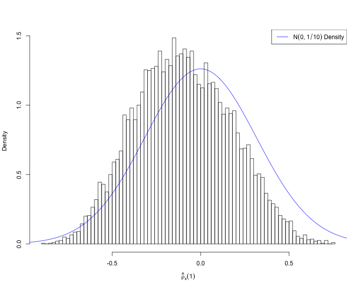
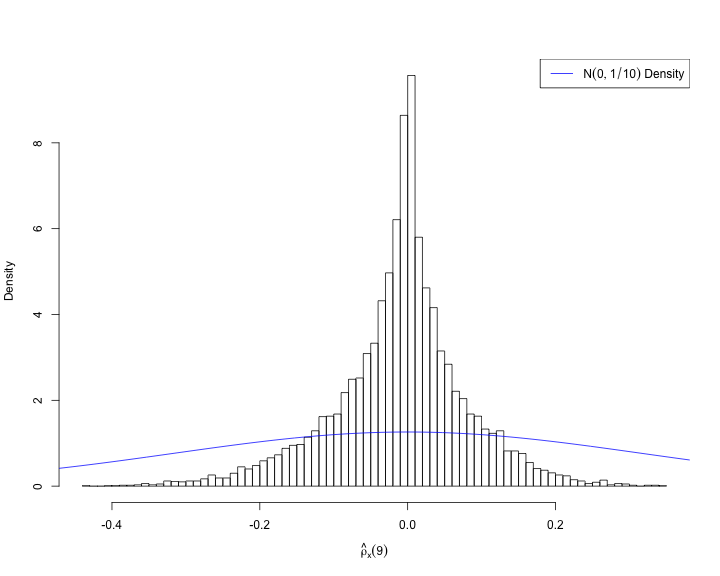
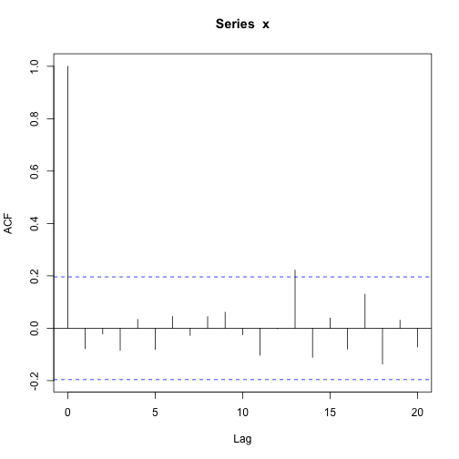
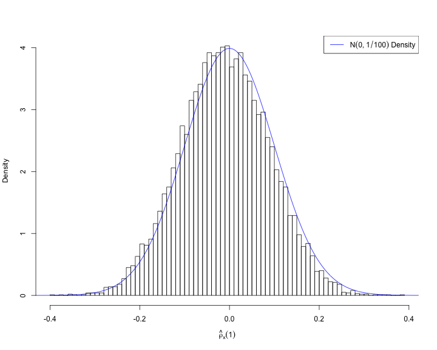

Autocorrelation
========================================================

The Autocorrelation Function
========================================================

For an $n\times 1$ **stationary** time series $\boldsymbol x$, the sample autocovariance function is

$$
\hat{\gamma}_x\left(h\right) = \frac{1}{n}\sum_{t = 1}^{n - h}\left(x_{t + h} - \hat{\mu}_x\right)\left(x_t - \hat{\mu}_x\right)
$$

The sample autocorrelation function is

$$
\hat{\rho}_x\left(h\right) = \hat{\gamma}_x\left(h\right)/\hat{\gamma}_x\left(0\right)
$$

We'll rely a lot on this result:

If $\boldsymbol x$ **white noise** and $v\sim\mathcal{N}\left(0, 1\right)$ $\implies$ $\hat{\rho}_x\left(h\right) \approx v/\sqrt{n}$

Length-10 Time Series
========================================================

Look at a sample ACF of $n=10$ **white noise**.


Length-10 Time Series, Lag-1
========================================================

Keep in mind that $\hat{\rho}_x\left(h\right) \boldsymbol \approx v/\sqrt{n}$ - we want to think carefully about when this is a **good** approximation. 

Let's simulate $\hat{\rho}_x\left(1\right)$ for a $n=10$ **white noise** time series.

```r
sim <- 10000
acf.1 <- unlist(lapply(1:sim, function(x) {
  x <- rnorm(n)
  x.acf <- acf(x, plot = FALSE, lag.max = 1)
  return(x.acf$acf[2, 1, 1])
}))
```

Length-10 Time Series, Lag-1
========================================================


Length-10 Time Series, Lag-9
========================================================

What if we look at bigger values of $h$?

Let's simulate $\hat{\rho}_x\left(9\right)$ for a $n=10$ **white noise** time series.

```r
sim <- 10000
acf.9 <- unlist(lapply(1:sim, function(x) {
  x <- rnorm(n)
  x.acf <- acf(x, plot = FALSE, lag.max = 9)
  return(x.acf$acf[10, 1, 1])
}))
```

Length-10 Time Series, Lag-9
========================================================



Length-100 Time Series
========================================================

What if we have a longer time series, e.g. $n=100$



Length-100 Time Series, Lag-1
========================================================

Look at the lag-1 sample autocorrelation again over repeated samples.

```r
sim <- 10000
acf.1 <- unlist(lapply(1:sim, function(x) {
  x <- rnorm(n)
  x.acf <- acf(x, plot = FALSE, lag.max = 1)
  return(x.acf$acf[2, 1, 1])
}))
```

Length-100 Time Series, Lag-1
========================================================

