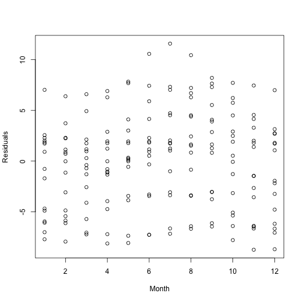
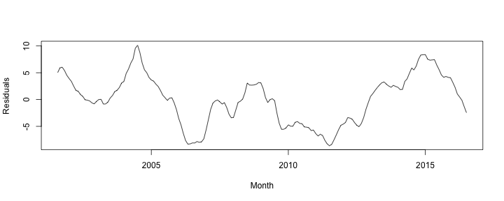
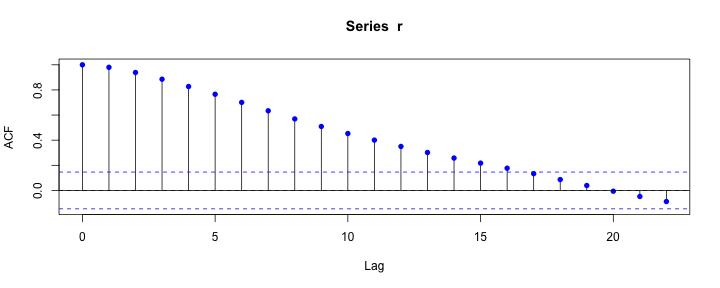

Homework 1 
========================================================

3. (a)
========================================================

In class, we regressed the the monthly price per pound of chicken on an intercept and the times the chicken prices were measured, $\boldsymbol t = \left(2001 + 7/12, \dots, 2015 + 11/12 \right)$. Plot the residuals from this regression as a function of the month. 


```r
library(astsa)
data(chicken)
fit <- lm(chicken~time(chicken))
month <- round((time(chicken) - floor(time(chicken)))*12, 0) + 1
```


3. (a)
========================================================


```r
plot(month, fit$residuals, xlab = "Month", ylab = "Residuals")
```




3. (b)
========================================================
Using `lm`, regress monthly price per pound of chicken on an intercept, $\boldsymbol t$, and indicators for the month the price was recorded. 


```r
fit.new <- lm(chicken~time(chicken)+factor(month))
```


3. (c)
========================================================
The `lm` function used in part (b) returns an estimate of $\sigma_w$. Is this the unbiased estimate $s^2_w$, or the maximum likelihood estimate $\hat{\sigma}^2_w$?


```r
summary(fit.new)$sig
```

```
[1] 4.712181
```

```r
sqrt(sum((chicken - fit.new$fitted.values)^2)/(length(chicken) - 
                                                 length(coef(fit.new))))
```

```
[1] 4.712181
```

3. (d)
========================================================
Describe and interpret the results of an $F$-test of the model used in (a) versus the regression model used in (b).  


```r
anova(fit, fit.new)
```

```
Analysis of Variance Table

Model 1: chicken ~ time(chicken)
Model 2: chicken ~ time(chicken) + factor(month)
  Res.Df    RSS Df Sum of Sq      F Pr(>F)
1    178 3925.9                           
2    167 3708.2 11    217.76 0.8916 0.5499
```


3. (e)
========================================================
Compute AIC values for the the model used in (a) and the model used in (b). Based on AIC, which model provides a better fit? Do AIC and the F-test agree?

<font size=6>

```r
n <- length(chicken)
k.fit <- length(coef(fit))
k.fit.new <- length(coef(fit.new))
ss.fit <- mean((chicken - fit$fitted.values)^2)
ss.fit.new <- mean((chicken - fit.new$fitted.values)^2)
log(ss.fit) + (n + 2*k.fit)/n
```

```
[1] 4.104627
```

```r
log(ss.fit.new) + (n + 2*k.fit.new)/n
```

```
[1] 4.169783
```
</font>

3. (f) and (g)
========================================================
(f) Plot the residuals from model (b) as a function of time.


```r
plot(time(chicken), fit.new$residuals, xlab = "Month", ylab = "Residuals", type = "l")
```



Referring back to (f), do you see evidence of correlated residuals across time?


3. (h)
========================================================
Plot the sample autocorrelation function of the residuals from model (b) for $h\leq 24$ without using the `acf` function or any other third party function that automatically computes the ACF. Include a dashed horizontal line at $0$. 

<font size=6>

```r
r <- fit.new$residuals
h <- seq(0, 24, by = 1)
acvf <- numeric(length(h))
time.diff <- outer(1:n, 1:n, "-")
rr <- outer(r, r, "*")
for (i in 1:length(h)) {
  acvf[i] <- (sum(rr[which(time.diff == h[i])]))/n
}
acrf <- acvf/acvf[1]
```
</font>

3. (h)
========================================================
Revisit (g) - do you see evidence of correlated residuals across time?
<font size=6>

```r
acf(r)
points(h, acrf, ylab = "ACF", xlab = "Lag", pch = 16, col = "blue")
abline(h = 0, lty = 2)
```


</font>
